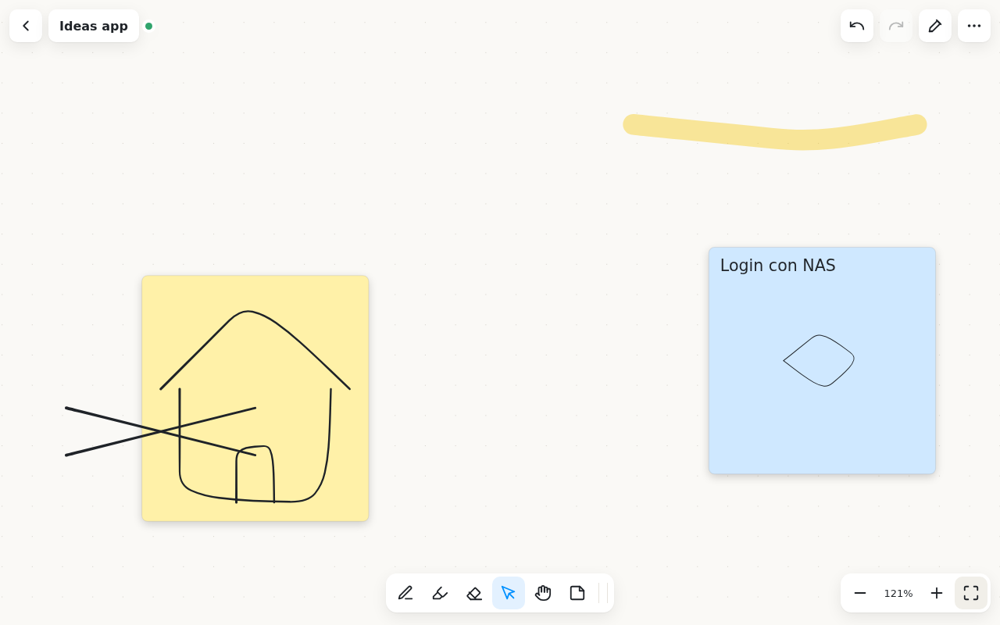
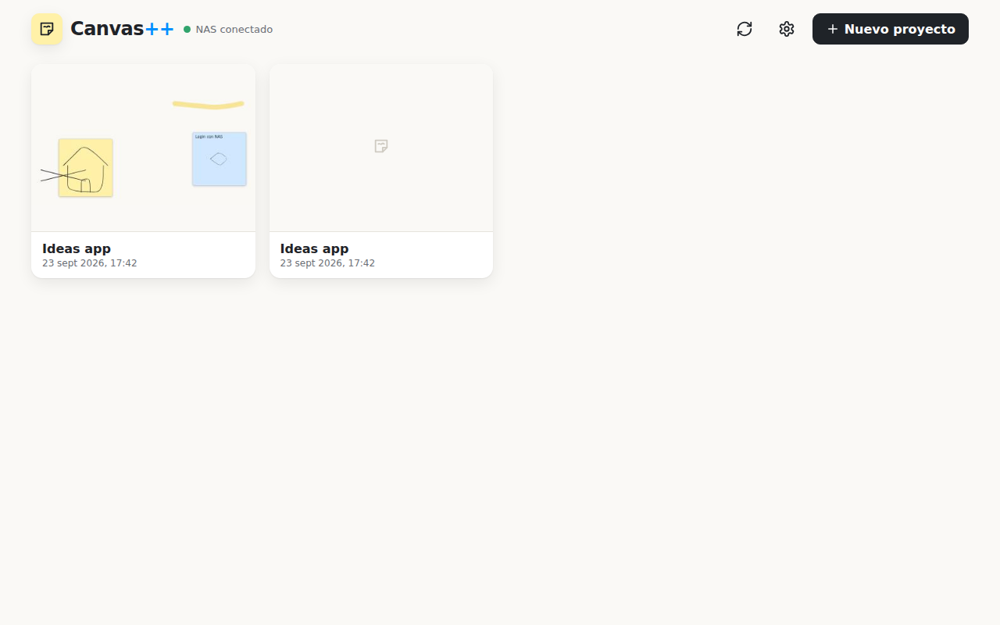
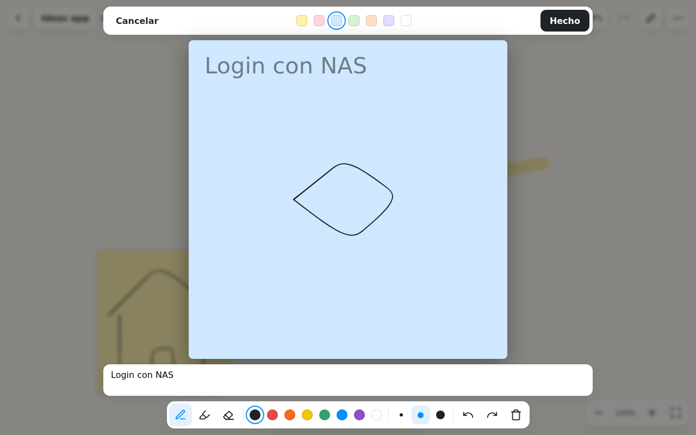

# Canvas++

Pizarra infinita para bocetar con el lápiz de la tablet. Los proyectos se sincronizan en tiempo real entre Android, Windows y el navegador a través de un pequeño servidor que corre en tu NAS.



## Funciones

- **Pizarra infinita** con zoom (5 % – 800 %) y cuadrícula de puntos.
- **Lápiz con presión** (S-Pen, Wacom, Surface Pen…), rotulador y borrador. El extremo borrador o el botón lateral del lápiz borran.
- **Modo lápiz** para evitar toques con la palma: el lápiz dibuja y el dedo mueve y hace zoom. Se activa solo la primera vez que se detecta un lápiz.
- **Post-its con sketch**: con la herramienta Post-it tocas la pizarra y se abre un lienzo grande donde dibujar. También puedes seleccionar trazos ya dibujados y pulsar **Hacer post-it** para convertirlos en una nota.
- Post-its con texto, 7 colores, redimensionables y movibles.
- **Varios proyectos**, con miniatura, renombrar y eliminar.
- **Sincronización en tiempo real** por WebSocket. Si se pierde la conexión se sigue trabajando y los cambios se suben al volver.
- Deshacer y rehacer, duplicar, traer al frente y exportar a PNG.
- Atajos: `P` lápiz · `M` rotulador · `E` borrador · `V` seleccionar · `H` mano · `N` post-it · `F` ver todo · `Espacio` + arrastrar para mover · `Ctrl+Z` / `Ctrl+Y` · `Supr`.

| Proyectos | Editor de post-it |
|---|---|
|  |  |

## Arquitectura

```
┌──────────────┐   ┌──────────────┐   ┌──────────────┐
│ Android      │   │ Windows      │   │ Navegador    │
│ (Capacitor)  │   │ (Electron)   │   │ http://nas   │
└──────┬───────┘   └──────┬───────┘   └──────┬───────┘
       │  WebSocket + REST (token)           │
       └──────────────┬──────────────────────┘
               ┌──────▼──────┐
               │ NAS: Docker │  server/  (Node)
               │ /data/*.json│  un JSON por proyecto
               └─────────────┘
```

- `app/`: cliente en TypeScript + Vite (Canvas 2D y [perfect-freehand](https://github.com/steveruizok/perfect-freehand)). La misma base de código se empaqueta para Android y Windows.
- `server/`: servidor Node de un solo archivo (`ws` es su única dependencia). Guarda cada proyecto en `/data/projects/<id>.json` y mueve los proyectos borrados a `/data/trash/`. También sirve el cliente web.
- **Sincronización:** cada trazo o post-it es un elemento independiente con su versión (`rev`, `by`). En caso de conflicto gana el cambio más reciente, elemento por elemento. Cada dispositivo guarda una copia en IndexedDB, así que funciona sin conexión.

## 1. Instalar el servidor en el NAS

Necesitas Docker (Synology Container Manager, QNAP Container Station, TrueNAS, Unraid, Portainer…).

**Opción A: imagen publicada.** Al subir el repo a GitHub, la acción *Imagen Docker* publica `ghcr.io/<tu-usuario>/canvaspp:latest` para amd64 y arm64. En `docker-compose.yml`, descomenta la línea `image:` con tu usuario y borra `build: .`. Si el paquete es privado, en GitHub ve a *Packages → canvaspp → Package settings* y cámbialo a público, o haz `docker login ghcr.io` en el NAS.

**Opción B: compilar en el NAS.** Copia el repo al NAS y ejecuta `docker compose up -d --build`.

En ambos casos:

1. Cambia `CANVAS_TOKEN` por una contraseña larga.
2. Ajusta el volumen a una carpeta del NAS, por ejemplo `/volume1/docker/canvaspp:/data`.
3. Arranca el contenedor y abre `http://IP-DEL-NAS:8787`. El cliente web ya funciona desde cualquier navegador.

> Fuera de casa: usa la VPN del NAS (WireGuard, Tailscale, OpenVPN). Si lo publicas en Internet, ponlo detrás del proxy inverso con HTTPS del NAS y usa `https://…` en la app.

## 2. Conectar las apps

En la app: ⚙ **Ajustes** → dirección `http://IP-DEL-NAS:8787` → token → **Probar conexión** → **Guardar**.

## 3. Descargar o compilar las apps

### Desde GitHub (sin instalar nada)

Crea una etiqueta y súbela:

```bash
git tag v0.1.0
git push origin v0.1.0
```

La acción *Apps (Windows + Android)* compila y adjunta a la Release:

- `Canvas++ Setup x.y.z.exe` (instalador) y `Canvas++ x.y.z.exe` (portable) para Windows.
- `Canvas++.apk` para Android (activa *Instalar apps desconocidas*).

El APK sale en modo debug salvo que añadas estos secretos del repositorio para firmarlo: `ANDROID_KEYSTORE_BASE64`, `ANDROID_KEYSTORE_PASSWORD`, `ANDROID_KEY_ALIAS` y `ANDROID_KEY_PASSWORD`.

### En local

Requisitos: Node 20+.

```bash
cd app
npm install
npm run dev          # desarrollo en el navegador (http://localhost:5173)

npm run win:dev      # abrir como app de Windows
npm run win:build    # generar instalador en app/electron/release/

npm run android:sync # genera/actualiza app/android (Capacitor)
npm run android:open # abre en Android Studio → Run / Build APK
```

Servidor local para desarrollo:

```bash
cd server && npm install
CANVAS_DATA=./data CANVAS_TOKEN=dev node index.js
```

## Variables del servidor

| Variable | Por defecto | Descripción |
|---|---|---|
| `PORT` | `8787` | Puerto HTTP/WebSocket |
| `CANVAS_TOKEN` | vacío | Token que piden las apps. Vacío significa sin autenticación (no recomendado). |
| `CANVAS_DATA` | `/data` | Carpeta de datos |
| `CANVAS_PUBLIC` | `./public` | Cliente web que se sirve |

## API

- `GET /api/health`
- `GET|POST /api/projects`: listar y crear. `POST {id, name, items?}` sube proyectos creados sin conexión.
- `GET|PATCH|DELETE /api/projects/:id`
- `WS /ws?project=&token=&client=`: mensajes `snapshot`, `ops` y `ack`.

## Licencia

MIT © 2026 Esther pKa
